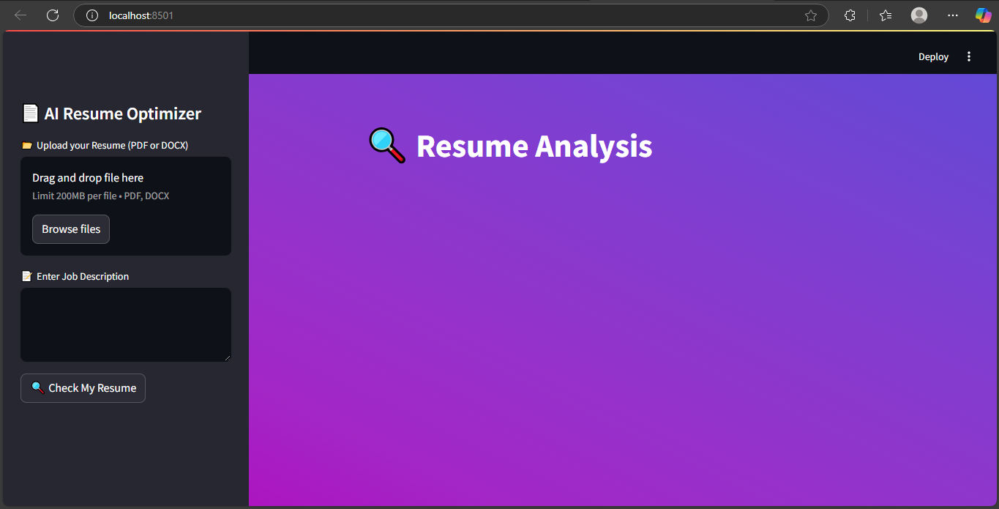
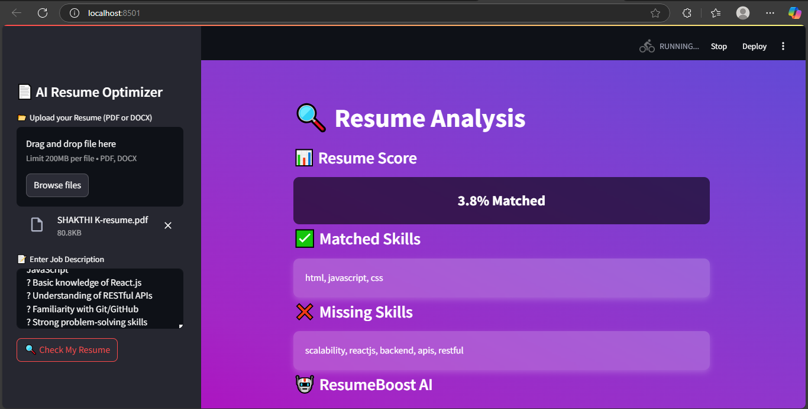
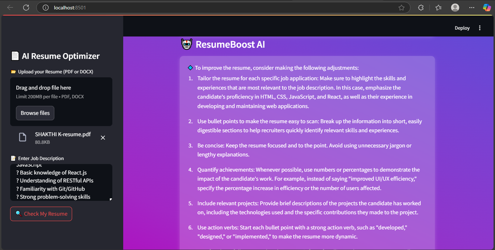

# 🚀 AI Resume Screening  
This is an AI-powered resume screening tool that helps analyze resumes efficiently.  

## 📥 Installation & Usage  
Follow these steps to set up and run the project:  

### 1️⃣ Clone the Repository  
```bash
git clone https://github.com/shakthivijay/ai_resume_screening.git && cd ai_resume_screening  # Clones the repo and navigates into the project folder
```

### 2️⃣ Install Dependencies  
```bash
pip install -r requirements.txt  # Installs required dependencies
```

### 3️⃣ Get Your Mistral API Key  
🔹 Go to [Mistral AI's website](https://mistral.ai/) → Sign up/log in → Generate a new API key → Copy the API key  

### 4️⃣ Set Up API Key  
```bash
echo "MISTRAL_API_KEY='your_api_key_here'" > .env  # Creates a .env file and sets your API key
```
🔹 **Replace** `"your_api_key_here"` with your actual API key from Mistral AI  

### 5️⃣ Run the App  
```bash
streamlit run app.py  # Starts the Streamlit app
```
## 📸 Output Preview  
Here’s how the AI Resume Screening tool looks in action:  

 

 # Replace with the correct image path


## 📌 Features  
✅ AI-based resume screening | ✅ Fast & efficient analysis | ✅ User-friendly interface  
